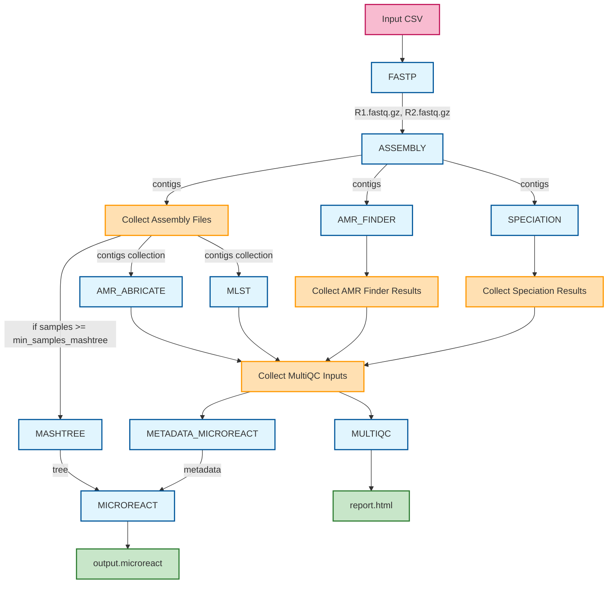

# Bacterial Genomics Pipeline

```mermaid
flowchart TD
    input[Input CSV] --> FASTP
    FASTP[FASTP] --> |R1.fastq.gz, R2.fastq.gz| ASSEMBLY
    ASSEMBLY[ASSEMBLY] --> |contigs| SPECIATION
    ASSEMBLY --> |contigs| AMR_FINDER
    ASSEMBLY --> |contigs| collect_assembly[Collect Assembly Files]
    
    collect_assembly --> |contigs collection| AMR_ABRICATE
    collect_assembly --> |contigs collection| MLST
    collect_assembly --> |"if samples >= min_samples_mashtree"| MASHTREE
    
    SPECIATION --> speciation_out[Collect Speciation Results]
    AMR_FINDER --> amr_finder_out[Collect AMR Finder Results]
    
    AMR_ABRICATE --> multiqc_in[Collect MultiQC Inputs]
    MLST --> multiqc_in
    amr_finder_out --> multiqc_in
    speciation_out --> multiqc_in
    
    multiqc_in --> MULTIQC
    multiqc_in --> METADATA_MICROREACT
    
    MASHTREE --> |tree| MICROREACT
    METADATA_MICROREACT --> |metadata| MICROREACT
    
    MULTIQC --> report[report.html]
    MICROREACT --> microreact_output[output.microreact]

    classDef process fill:#e1f5fe,stroke:#01579b,stroke-width:2px;
    classDef channel fill:#ffe0b2,stroke:#ff9800,stroke-width:2px;
    classDef output fill:#c8e6c9,stroke:#2e7d32,stroke-width:2px;
    classDef input fill:#f8bbd0,stroke:#c2185b,stroke-width:2px;
    
    class FASTP,ASSEMBLY,SPECIATION,AMR_ABRICATE,AMR_FINDER,MLST,MULTIQC,MASHTREE,METADATA_MICROREACT,MICROREACT process;
    class collect_assembly,multiqc_in,amr_finder_out,speciation_out channel;
    class report,microreact_output output;
    class input input;
```